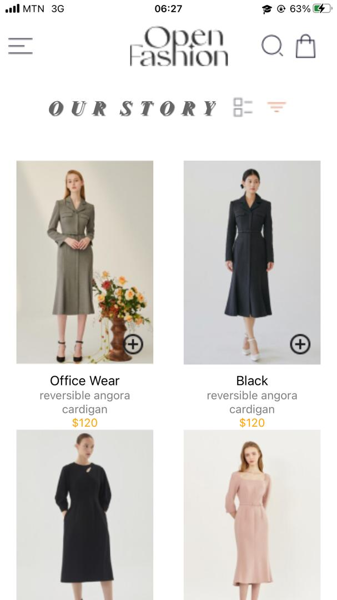
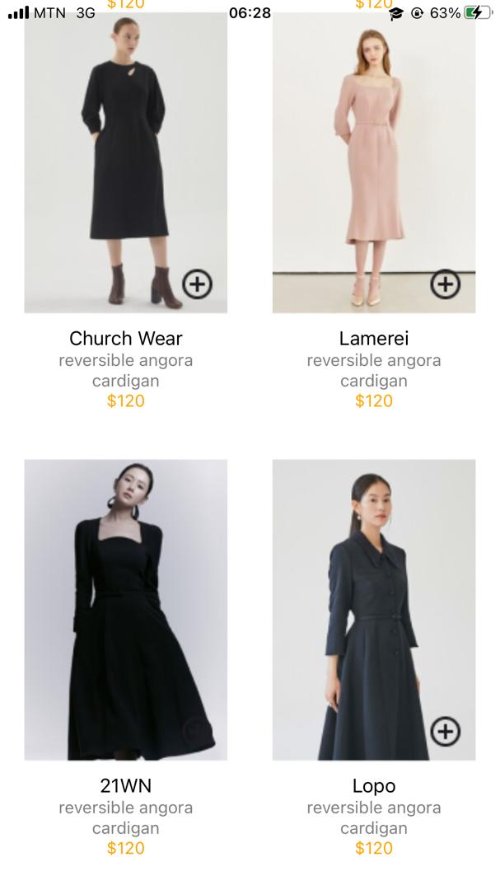
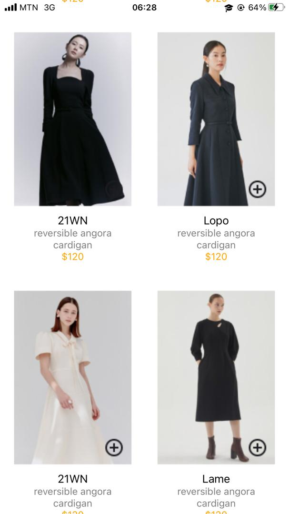
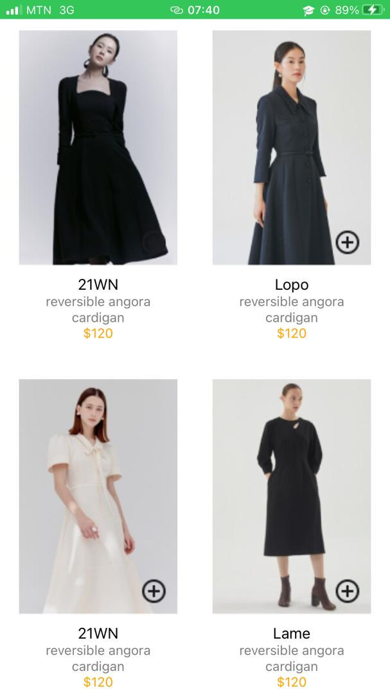
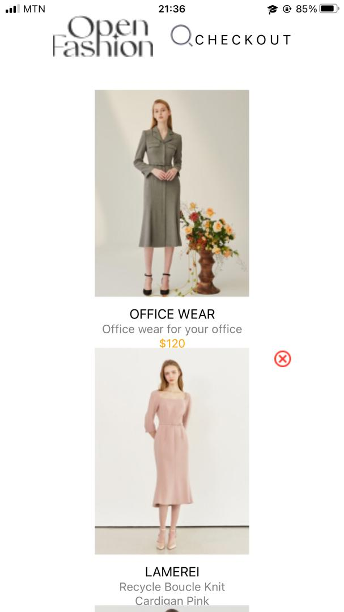
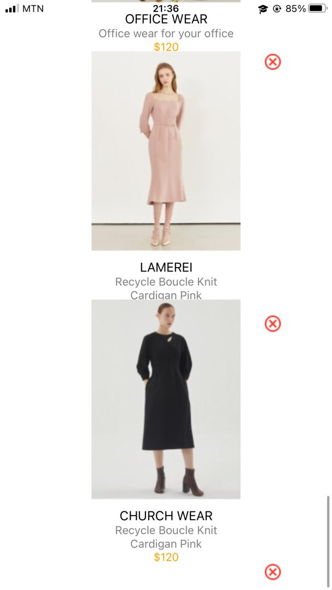

# rn-assignment6-11313444

# Screenshots

# README - Project Overview
This project is a React Native application with a site that displays a selection of dresses, each with its own name, description, and price. The application also features a menu, a logo, a search bar, and a shopping bag symboletc.

# Design Choices
# Flexibility and responsiveness:

The layout employs Flexbox to ensure that elements are properly aligned and responsive to various screen sizes.
ScrollView is used to enable vertical scrolling and accommodate a huge number of objects.
Image Placement:

Images are placed in specified containers (menuContainer, storyContainer, imageContainer, and so on) to ensure proper alignment and spacing.
The centeredLogoContainer is used to center the new logo and search the photos horizontally.
# Text styling:

Custom fonts and styles are applied to text components to achieve the desired design appearance.

# Data Storage:

The image data is kept locally in the assets folder.